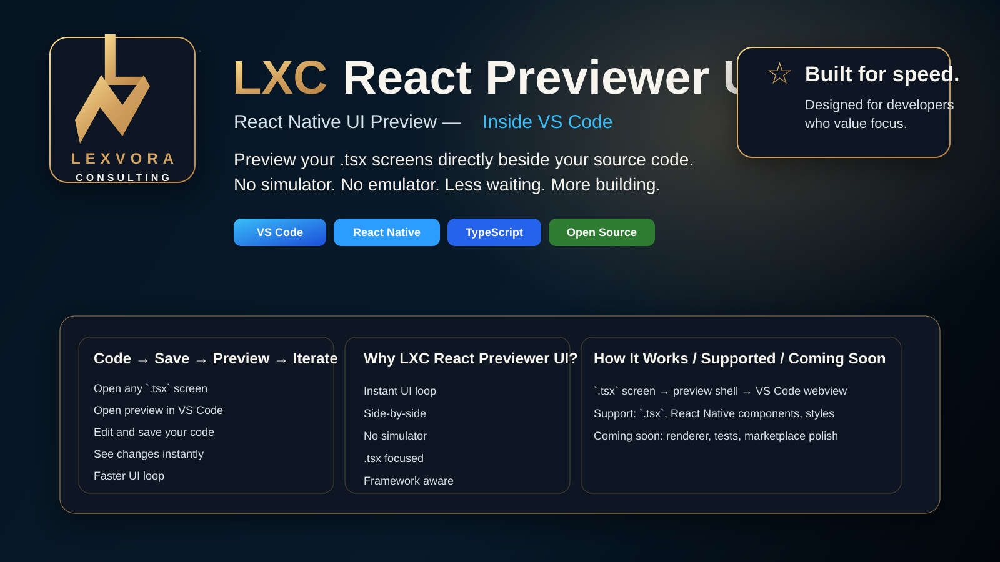

# LXC React Previewer UI

  

  <strong>Premium React Native preview for VS Code, shaped with Lexvora Consulting branding.</strong>

  
  
  

<table align="center" width="100%" style="border-collapse: separate; border-spacing: 12px;">
  <tr>
    <td align="center" style="background: linear-gradient(135deg, #061421 0%, #102d40 45%, #b88445 100%); color: #ffffff; border: 0; border-radius: 18px; padding: 16px 18px;">
      <strong style="font-size: 16px;">Fast</strong> 
      Preview inside the editor flow
    </td>
    <td align="center" style="background: linear-gradient(135deg, #061421 0%, #0b2233 45%, #d2a15f 100%); color: #ffffff; border: 0; border-radius: 18px; padding: 16px 18px;">
      <strong style="font-size: 16px;">Focused</strong> 
      Built for `.tsx` UI work
    </td>
    <td align="center" style="background: linear-gradient(135deg, #061421 0%, #102d40 50%, #f7f3ed 100%); color: #ffffff; border: 0; border-radius: 18px; padding: 16px 18px;">
      <strong style="font-size: 16px;">Flexible</strong> 
      Sample tree and frameworks picker
    </td>
    <td align="center" style="background: linear-gradient(135deg, #061421 0%, #b88445 50%, #d2a15f 100%); color: #ffffff; border: 0; border-radius: 18px; padding: 16px 18px;">
      <strong style="font-size: 16px;">Brand-led</strong> 
      Lexvora Consulting identity
    </td>
  </tr>
</table>

  

<table>
  <tr>
    <td width="33%" style="background: linear-gradient(135deg, #061421 0%, #102d40 52%, #d2a15f 100%); color: #ffffff; border: 0; border-radius: 18px; padding: 18px;">
      <strong>Preview Inside VS Code</strong> 
      Keep the source and rendered UI in one flow.
    </td>
    <td width="33%" style="background: linear-gradient(135deg, #061421 0%, #0b2233 50%, #38bdf8 100%); color: #ffffff; border: 0; border-radius: 18px; padding: 18px;">
      <strong>Lexvora Branded</strong> 
      Local logo assets and matching gold/blue tokens.
    </td>
    <td width="33%" style="background: linear-gradient(135deg, #061421 0%, #102d40 45%, #f7f3ed 100%); color: #ffffff; border: 0; border-radius: 18px; padding: 18px;">
      <strong>Built for Marketplace</strong> 
      A repo page that looks polished, premium, and ready to ship.
    </td>
  </tr>
</table>

  <a href="#what-it-is">What It Is</a> ·
  <a href="#feature-highlights">Feature Highlights</a> ·
  <a href="#visual-style">Visual Style</a> ·
  <a href="#preview-workflow">Preview Workflow</a> ·
  <a href="#sample-test-case">Sample Test Case</a> ·
  <a href="#changelog">Changelog</a> ·
  <a href="#contributing">Contributing</a>

<table>
  <tr>
    <td align="center" style="background: linear-gradient(180deg, #fbf8f3 0%, #ffffff 100%); border: 1px solid #d2a15f; border-radius: 14px; padding: 14px 16px;">
      <strong>Platform</strong> Visual Studio Code
    </td>
    <td align="center" style="background: linear-gradient(180deg, #fffdf9 0%, #ffffff 100%); border: 1px solid #b88445; border-radius: 14px; padding: 14px 16px;">
      <strong>Package</strong> `.vsix`
    </td>
    <td align="center" style="background: linear-gradient(180deg, #fffaf1 0%, #ffffff 100%); border: 1px solid #c8ba94; border-radius: 14px; padding: 14px 16px;">
      <strong>Brand</strong> Lexvora Consulting
    </td>
    <td align="center" style="background: linear-gradient(180deg, #fbf8f3 0%, #ffffff 100%); border: 1px solid #d2a15f; border-radius: 14px; padding: 14px 16px;">
      <strong>Focus</strong> React Native `.tsx`
    </td>
  </tr>
</table>

---

## What It Is

LXC React Previewer UI is an open-source VS Code extension that previews a React Native `.tsx` screen beside its source code without needing an emulator or simulator.

It is designed for fast UI iteration, a cleaner local workflow, and a more visually focused development loop.

## Feature Highlights

<table>
  <tr>
    <td width="50%" style="background: linear-gradient(180deg, #061421 0%, #102d40 100%); color: #ffffff; border: 0; border-radius: 16px; padding: 18px;">

### Source-Side Preview

Open a `.tsx` file and keep the preview directly beside the source so the design flow stays tight, visual, and easy to follow.

    </td>
    <td width="50%" style="background: linear-gradient(180deg, #0b2233 0%, #061421 100%); color: #ffffff; border: 0; border-radius: 16px; padding: 18px;">

### Save-to-Refresh Workflow

Make changes, save once, and keep the preview panel aligned with the current file without losing context or momentum.

    </td>
  </tr>
</table>

<table>
  <tr>
    <td width="50%" style="background: linear-gradient(180deg, #b88445 0%, #d2a15f 100%); color: #ffffff; border: 0; border-radius: 16px; padding: 18px;">

### Lexvora Branding

The extension ships with local Lexvora Consulting branding assets so the experience feels owned, premium, and consistent.

    </td>
    <td width="50%" style="background: linear-gradient(180deg, #102d40 0%, #061421 100%); color: #ffffff; border: 0; border-radius: 16px; padding: 18px;">

### Sample Test Surface

A `sample/` tree is included so preview behavior can be checked on nested files instead of only a single flat example.

### Brand Tokens

The shared brand CSS lives in [`assets/marketplace-style.css`](assets/marketplace-style.css) and mirrors the Lexvora Consulting palette used in the web presence.

### Visual Source

If you want to reuse the branding outside the README, start with [`assets/marketplace-style.css`](assets/marketplace-style.css) and [`assets/marketplace-hero.svg`](assets/marketplace-hero.svg).

    </td>
  </tr>
</table>

<table>
  <tr>
    <td width="33%" style="background: linear-gradient(180deg, #fffaf1 0%, #ffffff 100%); border: 1px solid #d2a15f; border-radius: 16px; padding: 18px;">

### Built For

- React Native UI previews
- Source-side iteration
- VS Code workflow speed
- Local development clarity

    </td>
    <td width="33%" style="background: linear-gradient(180deg, #fbf8f3 0%, #ffffff 100%); border: 1px solid #c8ba94; border-radius: 16px; padding: 18px;">

### Intended Feel

- High signal
- Low friction
- Clean visual separation
- Deliberate presentation

    </td>
    <td width="33%" style="background: linear-gradient(180deg, #fffdf9 0%, #ffffff 100%); border: 1px solid #b88445; border-radius: 16px; padding: 18px;">

### Brand Promise

- Open source
- Maintained under Lexvora Consulting
- Contributor-friendly
- Easy to resume and extend

    </td>
  </tr>
</table>

## Visual Style

The project aims for a polished, dramatic GitHub presence and a preview shell that feels intentional rather than placeholder-driven.

<table>
  <tr>
    <td style="background: linear-gradient(135deg, #061421 0%, #102d40 45%, #b88445 100%); color: #ffffff; border: 0; border-radius: 16px; padding: 18px;">
      <strong>Visual Language</strong> 
      Dark depth, bright accents, wide spacing, and strong contrast.
    </td>
    <td style="background: linear-gradient(135deg, #061421 0%, #0b2233 45%, #d2a15f 100%); color: #ffffff; border: 0; border-radius: 16px; padding: 18px;">
      <strong>Experience Goal</strong> 
      Make the repo feel like a premium product page, not a bare scaffold.
    </td>
  </tr>
</table>

<table>
  <tr>
    <td width="50%" style="background: linear-gradient(180deg, #fffaf1 0%, #ffffff 100%); border: 1px solid #d2a15f; border-radius: 16px; padding: 18px;">

### Design Goals

- Bold, high-contrast presentation
- Clear source-and-preview side-by-side layout
- Strong visual hierarchy
- Clean open-source branding
- A workflow that feels fast and deliberate

    </td>
    <td width="50%" style="background: linear-gradient(180deg, #fbf8f3 0%, #ffffff 100%); border: 1px solid #c8ba94; border-radius: 16px; padding: 18px;">

### Product Shape

- Open a `.tsx` file
- Show the preview beside the source
- Refresh on save
- Keep the current file context in memory
- Stay ready for a richer React Native renderer

    </td>
  </tr>
</table>

## Preview Workflow

<table>
  <tr>
    <td align="center" style="background: linear-gradient(180deg, #fbf8f3 0%, #ffffff 100%); border: 1px solid #d2a15f; border-radius: 14px; padding: 14px;"><strong>1</strong> Open a `.tsx` file</td>
    <td align="center" style="background: linear-gradient(180deg, #fffdf9 0%, #ffffff 100%); border: 1px solid #b88445; border-radius: 14px; padding: 14px;"><strong>2</strong> Run the preview command</td>
    <td align="center" style="background: linear-gradient(180deg, #fffaf1 0%, #ffffff 100%); border: 1px solid #c8ba94; border-radius: 14px; padding: 14px;"><strong>3</strong> Inspect source and preview side by side</td>
    <td align="center" style="background: linear-gradient(180deg, #fdfbf7 0%, #ffffff 100%); border: 1px solid #e6ad47; border-radius: 14px; padding: 14px;"><strong>4</strong> Save the file and watch it refresh</td>
  </tr>
</table>

<table>
  <tr>
    <td align="center" style="background: linear-gradient(135deg, #061421 0%, #102d40 45%, #b88445 100%); color: #ffffff; border: 0; border-radius: 16px; padding: 12px 16px;">
      <strong>Open</strong> Choose the target `.tsx`
    </td>
    <td align="center" style="background: linear-gradient(135deg, #061421 0%, #0b2233 45%, #d2a15f 100%); color: #ffffff; border: 0; border-radius: 16px; padding: 12px 16px;">
      <strong>Preview</strong> Side panel appears beside source
    </td>
    <td align="center" style="background: linear-gradient(135deg, #061421 0%, #102d40 50%, #f7f3ed 100%); color: #ffffff; border: 0; border-radius: 16px; padding: 12px 16px;">
      <strong>Refresh</strong> Save the file and update live
    </td>
  </tr>
</table>

### Commands

- `LXC React Previewer: Open Preview`
- `LXC React Previewer: Refresh Preview`
- `LXC React Previewer: Select Frameworks Folder`

### Current Behavior

<table>
  <tr>
    <td width="50%" style="background: linear-gradient(180deg, #f0f9ff 0%, #ffffff 100%); border: 1px solid #7dd3fc; border-radius: 16px; padding: 18px;">

#### Working Today

- Opens the active `.tsx` file and anchors the preview beside it
- Shows the source and preview together for faster UI iteration
- Keeps the preview tied to the selected file context
- Refreshes the preview when the file is saved
- Stores the selected shared frameworks folder for reuse
- Displays source metadata and brand cues in the preview shell
- Uses the local Lexvora logo assets for consistent branding

    </td>
    <td width="50%" style="background: linear-gradient(180deg, #fdf2f8 0%, #ffffff 100%); border: 1px solid #f9a8d4; border-radius: 16px; padding: 18px;">

#### Still In Progress

- Real React Native renderer
- Preview refresh when switching files
- Better error handling for unsupported cases
- Automated smoke tests
- Marketplace publishing prep
- Marketplace icon and final listing polish

    </td>
  </tr>
</table>

## Sample Test Case

Use the `sample/` tree to validate the preview experience.

<table>
  <tr>
    <td width="50%" style="background: linear-gradient(180deg, #faf5ff 0%, #ffffff 100%); border: 1px solid #d8b4fe; border-radius: 16px; padding: 18px;">

### Why It Exists

- Gives you a visible test workspace
- Lets you try nested file paths
- Makes manual preview checks repeatable

    </td>
    <td width="50%" style="background: linear-gradient(180deg, #ecfeff 0%, #ffffff 100%); border: 1px solid #67e8f9; border-radius: 16px; padding: 18px;">

### What It Proves

- The command works
- The preview panel opens
- The saved file refreshes
- Nested React source stays usable

    </td>
  </tr>
</table>

<table>
  <tr>
    <td align="center" style="background: linear-gradient(180deg, #fbf8f3 0%, #ffffff 100%); border: 1px solid #d2a15f; border-radius: 14px; padding: 14px;"><strong>Sample Root</strong> `sample/`</td>
    <td align="center" style="background: linear-gradient(180deg, #fffaf1 0%, #ffffff 100%); border: 1px solid #c8ba94; border-radius: 14px; padding: 14px;"><strong>Nested Files</strong> React source anywhere below it</td>
    <td align="center" style="background: linear-gradient(180deg, #fffdf9 0%, #ffffff 100%); border: 1px solid #b88445; border-radius: 14px; padding: 14px;"><strong>Goal</strong> Preview workflow sanity check</td>
  </tr>
</table>

### Try It

1. Open the repository in VS Code.
2. Open a `.tsx` file under `sample/`.
3. Run `LXC React Previewer: Open Preview`.
4. Confirm the preview opens beside the editor.
5. Save the file and confirm the preview refreshes.
6. Repeat with a nested file such as `sample/screens/Home/HomeScreen.tsx`.

### Sample Files

- [`sample/README.md`](sample/README.md)
- [`sample/SamplePreview.tsx`](sample/SamplePreview.tsx)
- [`sample/screens/Home/HomeScreen.tsx`](sample/screens/Home/HomeScreen.tsx)
- [`sample/components/cards/PreviewCard.tsx`](sample/components/cards/PreviewCard.tsx)

## Frameworks Folder

If your React Native runtime or shared packages live separately, keep them in:

`/Users/SageVish/Documents/Development Work/frameworks`

The extension remembers the folder you choose with `LXC React Previewer: Select Frameworks Folder` and shows it in the preview shell.

## Project Snapshot

<table>
  <tr>
    <td width="50%" style="background: linear-gradient(180deg, #f0f9ff 0%, #ffffff 100%); border: 1px solid #7dd3fc; border-radius: 16px; padding: 18px;">

### Finished

- Repository and GitHub remote
- Extension scaffold
- First build and package
- Core product direction
- Preview shell and save refresh
- Sample test content
- Brand and documentation base

    </td>
    <td width="50%" style="background: linear-gradient(180deg, #fff7ed 0%, #ffffff 100%); border: 1px solid #fdba74; border-radius: 16px; padding: 18px;">

### Next Major Work

- Real renderer
- Better live update behavior
- Smoke tests
- Marketplace-facing polish
- Packaging and publish prep

    </td>
  </tr>
</table>

<table>
  <tr>
    <td align="center" style="background: linear-gradient(135deg, #061421 0%, #102d40 45%, #b88445 100%); color: #ffffff; border: 0; border-radius: 14px; padding: 12px 16px;">
      <strong>Repository Mood</strong> Premium, focused, and extendable
    </td>
    <td align="center" style="background: linear-gradient(135deg, #061421 0%, #0b2233 45%, #d2a15f 100%); color: #ffffff; border: 0; border-radius: 14px; padding: 12px 16px;">
      <strong>Current Priority</strong> Renderer, tests, and marketplace prep
    </td>
    <td align="center" style="background: linear-gradient(135deg, #061421 0%, #102d40 50%, #f7f3ed 100%); color: #ffffff; border: 0; border-radius: 14px; padding: 12px 16px;">
      <strong>Current State</strong> Ready to iterate
    </td>
  </tr>
</table>

## Open Source

This project is open source and welcomes contributors.

> The goal is to make the preview workflow feel fast, beautiful, and practical.

- Improvements should stay focused on the previewer
- Issues, pull requests, and documentation help are welcome
- Track major decisions in [`CONTEXT.md`](CONTEXT.md)
- Track work items and subtasks in [`TASKS.md`](TASKS.md)
- License: [`MIT`](LICENSE)

## Changelog

See [`CHANGELOG.md`](CHANGELOG.md) for the release history and unreleased notes.

## Organization

**Lexvora Consulting**

This project is maintained under the Lexvora Consulting brand.

Brand asset:

[`assets/lexvora-consulting-mark.svg`](assets/lexvora-consulting-mark.svg)

## Supported Development Environments

- macOS development and testing is the current primary setup
- Windows testing and feedback are welcome
- Linux support can be explored later if it helps the extension

## Decisions Already Made

- Target platform: Visual Studio Code
- Packaging format: `.vsix`
- Preview style: extension webview
- Audience: React Native developers
- Release posture: open source
- Maintenance style: contributor-friendly and documented

## Next Milestones

1. Complete the real React Native preview renderer.
2. Add stronger file watching and update logic.
3. Add tests, checks, and packaging validation.
4. Prepare release metadata and publish notes.
5. Continue polishing the README and marketplace story.

## Contributing

Read [`TASKS.md`](TASKS.md) before starting work.
Read [`CONTEXT.md`](CONTEXT.md) for project direction and contribution rules.
Use small commits and keep changes aligned with the previewer goal.
